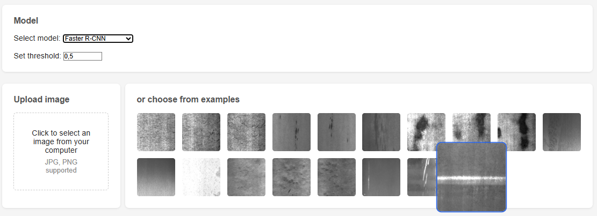
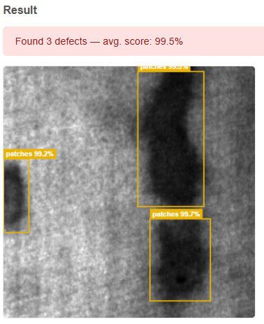
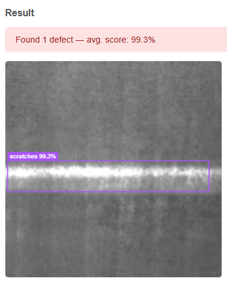
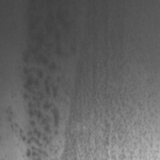

# Defect Detection System

A computer vision web application for detecting surface defects in steel images.
Compares two object detection architectures — **Faster R-CNN** and **YOLOv8** — via an interactive UI.



| | |
|---|---|
|  |  |

---

## Defect Classes

| crazing | inclusion | patches |
|---|---|---|
|  |  |  |

| pitted_surface | rolled-in_scale | scratches |
|---|---|---|
|  |  |  |

---

## Results

Evaluated on 360 validation images (NEU-DET dataset, 6 defect classes).

| Model | mAP50 | mAP50-95 | Speed |
|---|---|---|---|
| Faster R-CNN ResNet50 | **0.928** | **0.573** | ~200ms/img |
| YOLOv8n fine-tuned | 0.726 | 0.417 | ~5ms/img |

<details>
<summary>Per-class mAP50-95</summary>

| Class | Faster R-CNN | YOLOv8n |
|---|---|---|
| crazing | 0.441 | 0.152 |
| inclusion | 0.575 | 0.435 |
| patches | 0.686 | 0.597 |
| pitted_surface | 0.590 | 0.542 |
| rolled-in_scale | 0.575 | 0.229 |
| scratches | 0.572 | 0.545 |

</details>

---

## Features

- Upload an image or select from example gallery
- Choose detection model and confidence threshold from the UI
- Bounding boxes rendered on canvas with per-class color coding
- REST API built with FastAPI

---

## Architecture

Models follow the **Strategy pattern** — a shared interface allows switching between detectors without changing the API or frontend.

```
app/predictors/
├── base.py            # Abstract base class
├── faster_rcnn.py     # Faster R-CNN ResNet50 (custom-trained)
├── yolo.py            # YOLOv8n pre-trained on COCO
└── yolo_finetuned.py  # YOLOv8n fine-tuned on NEU-DET
```

Models are **lazy-loaded** — instantiated on first request and cached, so startup is instant regardless of how many models are registered.

---

## Dataset

**NEU Surface Defect Database** — 1800 grayscale images of hot-rolled steel strip.

| Class | Images |
|---|---|
| crazing | 300 |
| inclusion | 300 |
| patches | 300 |
| pitted_surface | 300 |
| rolled-in_scale | 300 |
| scratches | 300 |

Annotations originally in Pascal VOC XML format, converted to YOLO format via `scripts/prepare_dataset.py`.
See [data/README.md](data/README.md) for download instructions.

---

## Tech Stack

- **Backend:** FastAPI, PyTorch, torchvision, ultralytics (YOLOv8)
- **Frontend:** Vanilla HTML/CSS/JS, Canvas API
- **Training:** Kaggle (NVIDIA T4 GPU)
- **Evaluation:** torchmetrics

---

## Getting Started

### 1. Clone and install

```bash
git clone https://github.com/piotr-sawicki/defect-detection-system.git
cd defect-detection-system
pip install -r requirements.txt
```

### 2. Download model weights

Download the dataset and model weights — see [data/README.md](data/README.md).

Place weights in the `data/` directory:
```
data/
├── FastRCNNweights.pth
└── yolo_steel_best.pt
```

### 3. Run

```bash
uvicorn app.main:app --reload
```

Open `http://localhost:8000` in your browser.

---

## Project Structure

```
├── app/
│   ├── main.py              # FastAPI app
│   ├── routes.py            # API endpoints
│   ├── schemas.py           # Pydantic models
│   └── predictors/          # Detection models (Strategy pattern)
├── frontend/
│   └── index.html           # Single-page UI
├── scripts/
│   ├── prepare_dataset.py   # VOC XML → YOLO format conversion
│   ├── train_yolo.py        # YOLOv8 fine-tuning (Kaggle)
│   └── evaluate_models.py   # Side-by-side model evaluation
├── data/                    # Weights, dataset (gitignored)
└── requirements.txt
```
